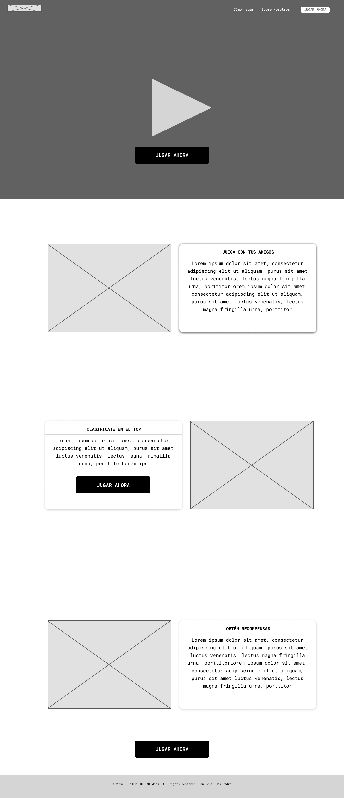
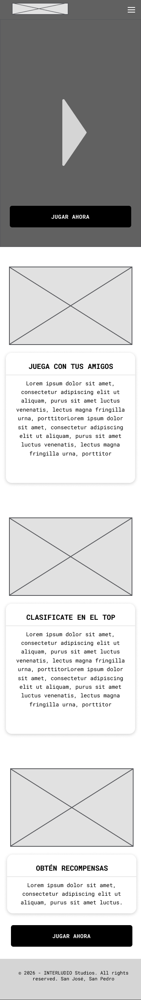
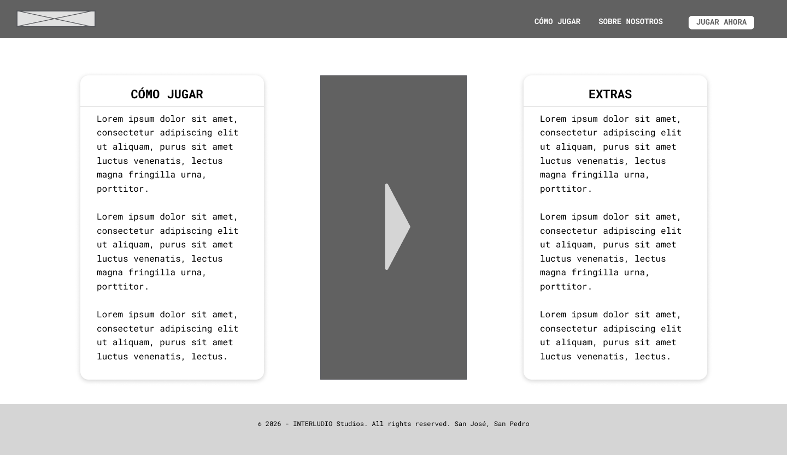
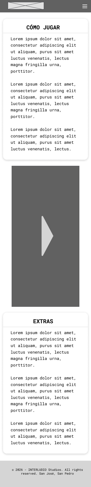
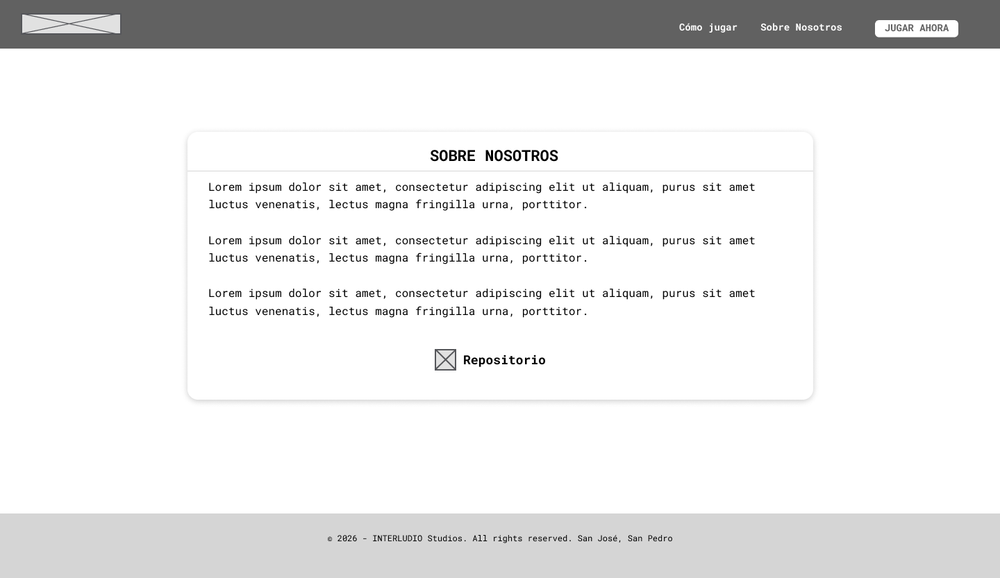
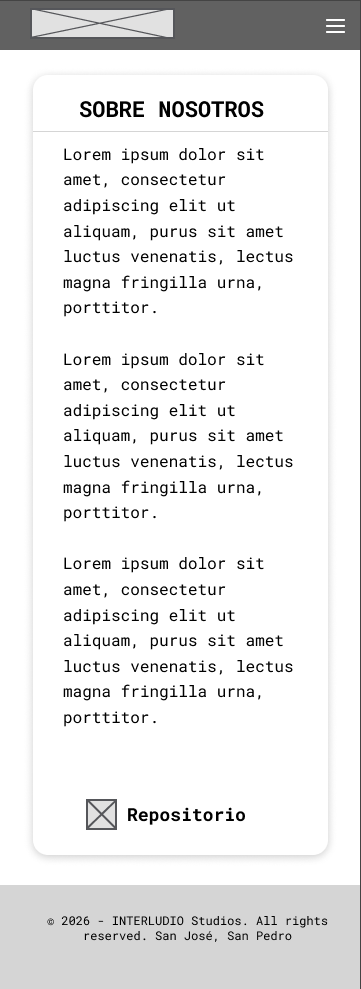
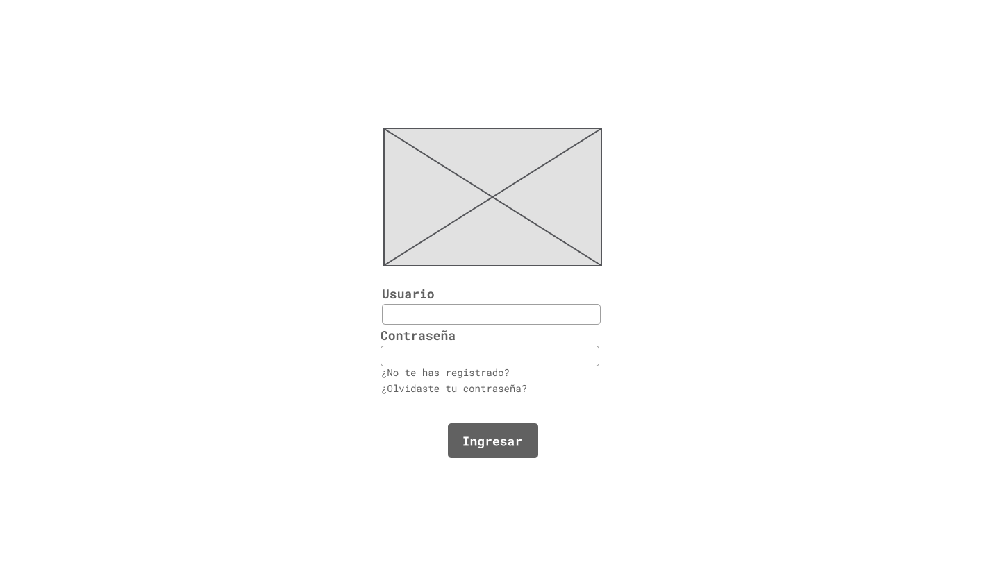
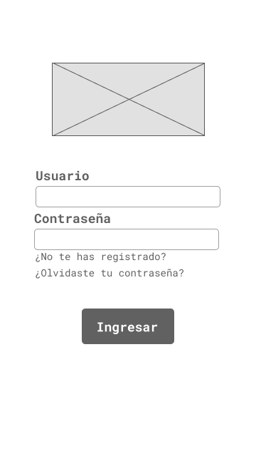

# Justificación de decisiones de diseño de wireframes

Dentro de las justificaciones de cada wireframe, se consideran los dos
wireframes a la vez, el de escritorio y dispositivos móviles. Los wireframes en
móvil son esencialmente iguales a los de escritorio, solo que su interfaz varía
porque las dimensiones de la pantalla son distintas. Sin embargo, contienen
los mismos contenidos que las contrapartes de escritorio.

## Página de bienvenida

- **Encabezado**: permite identificar el sitio y navegación a las páginas de
  _Cómo Jugar_ y _Sobre Nosotros_, y un acceso directo al juego mediante el
  botón de _JUGAR AHORA_.
- **Sección _hero_**: presenta un clip del juego para llamar la atención del
  usuario al llegar a la página y le permite ingresar mediante el botón de
  jugar.
- **Botón “Jugar ahora”**: se coloca como llamada a la acción principal,
  instando al usuario a jugar en ese instante en que lo ve.
- **“Juega con tus amigos”**: comunica que el juego tiene un componente
  multijugador e incita al usuario a invitar a sus amigos para jugar juntos.
- **“Clasifícate en el top”**: comunica el componente competitivo del juego,
  motivando al instinto competitivo de los usuarios.
- **“Obtén recompensas”**: presenta uno de los incentivos del juego, en parte es
  una razón adicional para crearse una cuenta en el juego.
- **Pie de página**: contiene la información básica del proyecto y no se
  pretende que el jugador encuentre algo relevante en esa sección.

## Página de cómo jugar

- **Encabezado**: permite identificar el sitio y navegación a las páginas de
  _Cómo Jugar_ y _Sobre Nosotros_, y un acceso directo al juego mediante el
  botón de _JUGAR AHORA_.
- **“Cómo jugar”**: sugiere las instrucciones necesarias para que el usuario
  comprenda el funcionamiento del juego antes de comenzar.
- **Video central**: permite explicar de manera visual la dinámica del juego,
  complementando las instrucciones escritas.
- **“Extras”**: presenta información adicional sobre elementos o características
  complementarias del juego que pueden ser de interés para el usuario. Este
  apartado es tentativo, y puede cambiar su propósito posteriormente según el
  tipo de información que queremos presentar.
- **Pie de página**: contiene la información básica del proyecto y no se
  pretende que el jugador encuentre algo relevante en esa sección.

## Página sobre nosotros

- **Encabezado**: permite identificar el sitio y navegación a las páginas de
  _Cómo Jugar_ y _Sobre Nosotros_, y un acceso directo al juego mediante el
  botón de _JUGAR AHORA_.
- **Contenedor central con título**: el contenido va dentro de una tarjeta
  blanca centrada con el título "SOBRE NOSOTROS", separando visualmente la
  información del resto del sitio.
- **Bloques de texto tipo Lorem Ipsum**: representan los párrafos tentativos
  para la descripción del grupo de desarrolladores (quiénes son, qué hacen,
  contexto del juego).
- **Ícono + enlace "Repositorio"**: da acceso directo al código/proyecto.
- **Pie de página**: contiene la información básica del proyecto y no se
  pretende que el jugador encuentre algo relevante en esa sección.

## Página de inicio de sesión

- **Logo/imagen placeholder centrado**: espacio reservado para el logo del
  juego, es un elemento estético para que el usuario sepa dónde está.
- **Campos "Usuario" y "Contraseña"**: los dos campos necesarios para ingresar
  sesión, con etiquetas claras y visibles.
- **Enlaces "¿No te has registrado?" y "¿Olvidaste tu contraseña?"**: son dos
  enlaces que permiten al usuario acceder a las funcionalidades de registro y
  recuperación de contraseña.
- **Botón "Ingresar" destacado**: único call-to-action visible, en color sólido,
  dando a entender cuál es la acción principal de la página.

## Página de registro

- **Logo/imagen placeholder centrado**: espacio reservado para el logo del
  juego, es un elemento estético para que el usuario sepa dónde está.
- **Cuatro campos**: Usuario, Correo electrónico, Contraseña, Confirmar
  contraseña: cubren los datos mínimos necesarios para crear una cuenta única.
- **Campo "Correo electrónico" adicional al login**: se requiere porque es el
  medio de contacto/verificación de la cuenta.
- **Campo "Confirmar contraseña"**: previene errores de tipeo al crear la
  contraseña.
- **Botón "Registrarse" destacado**: único call-to-action visible, en color
  sólido.
